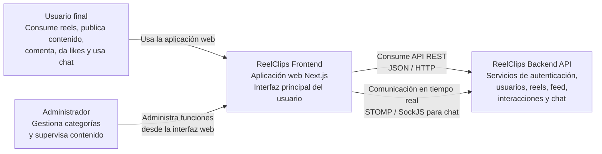

# C4 Nivel 1 - Contexto

```mermaid
flowchart LR

    usuario["Usuario final<br/>Consume reels, publica contenido,<br/>comenta, da likes y usa chat"]

    admin["Administrador<br/>Gestiona categorías<br/>y supervisa contenido"]

    frontend["ReelClips Frontend<br/>Aplicación web Next.js<br/>Interfaz principal del usuario"]

    backend["ReelClips Backend API<br/>Servicios de autenticación,<br/>usuarios, reels, feed,<br/>interacciones y chat"]

    usuario -->|"Usa la aplicación web"| frontend

    admin -->|"Administra funciones<br/>desde la interfaz web"| frontend

    frontend -->|"Consume API REST<br/>JSON / HTTP"| backend

    frontend -->|"Comunicación en tiempo real<br/>STOMP / SockJS para chat"| backend
```