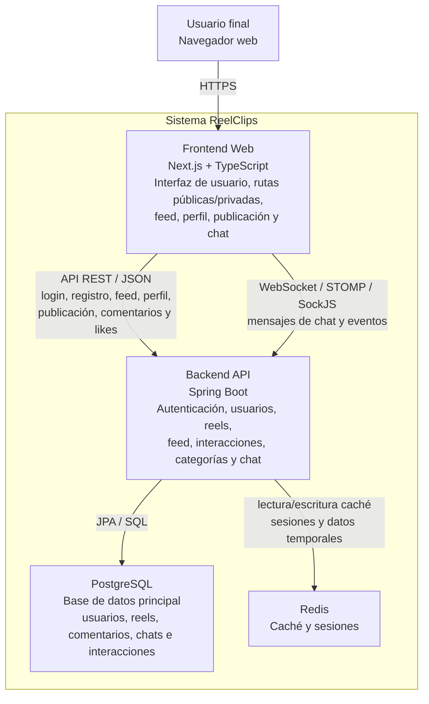

# C4 Nivel 2 - Contenedores

```mermaid
flowchart TB

    usuario["Usuario final<br/>Navegador web"]

    subgraph sistema["Sistema ReelClips"]

        frontend["Frontend Web<br/>Next.js + TypeScript<br/>Interfaz de usuario, rutas públicas/privadas,<br/>feed, perfil, publicación y chat"]

        backend["Backend API<br/>Spring Boot<br/>Autenticación, usuarios, reels,<br/>feed, interacciones, categorías y chat"]

        postgres["PostgreSQL<br/>Base de datos principal<br/>usuarios, reels, comentarios, chats e interacciones"]

        redis["Redis<br/>Caché y sesiones"]

    end

    usuario -->|"HTTPS"| frontend

    frontend -->|"API REST / JSON<br/>login, registro, feed, perfil,<br/>publicación, comentarios y likes"| backend

    frontend -->|"WebSocket / STOMP / SockJS<br/>mensajes de chat y eventos"| backend

    backend -->|"JPA / SQL"| postgres

    backend -->|"lectura/escritura caché<br/>sesiones y datos temporales"| redis
```